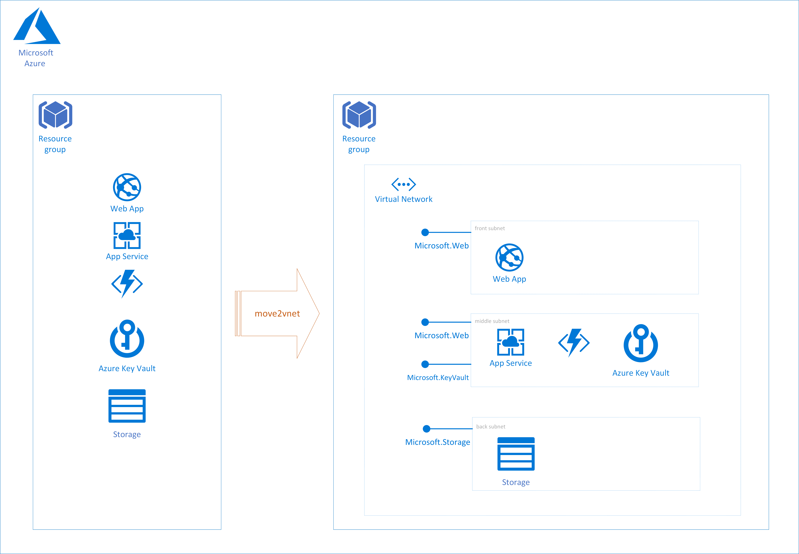

# Azure - move2vnet

`move2vnet` "moves" Azure resources to a VNet.

## Why?

This script answers to many real life needs.
It happens that the development of a project starts and security is not considered (whatever will be the reason). Sometimes we are confronted to the need of having to add security afterwords.

Security implementation can take many forms.
VNet is one of them: simple, effective and not intrusive (it does not require modifying applications).

Adding that kind of security once the design of the application as been designed (or implemented, even worse) can be tedious work.
So, why not to try to find some helpers or accelerators?

Another interesting use case would be to use `move2vnet` to add VNet security to already running applications.

> So, adding VNet security seamlessly to an application is the why.

## How does it work?

The script lists all the Azure resources in a given resource group.
The scripts checks whether the targeted VNet exists. If it does not exist, it is created with 3 subnets:
 - front, mainly for web sites
 - middle, mainly for APIs, Azure Functions, Service Bus, etc
 - back, mainly for storage services

`move2vnet` manages a limite amount of resource types:
 - Microsoft.Web/sites 
 - Microsoft.Storage/storageAccounts
 - Microsoft.KeyVault/vaults

The appropriate and required service endpoints for each subnet are created by the script:
 - Microsoft.Web
 - Microsoft.Storage
 - Microsoft.KeyVault

> Note:
> Not all the Azure resources can be configured with a VNet.
> Furthermore, VNet is only available for certain SKUs.
> These constraints have be to be taken into account by yourself (not managed by the script for now).

The Azure resources are spread out in the different subnets, according to their  type.

### How to use move2vnet?

The current version requires 3 parameters:
 - subscriptionId
 - resrouce group containing the Azure resources to add VNet security to
 - the name of the VNet

Example:

`./move2vnet.sh -s "ec91c862-9472-4bb7-9c61-64727c764999" -g "move2vnettest" -n "vnetmove2vnet"`

### Traces
`move2vnet`
# Azure - move2vnet

`move2vnet` "moves" Azure resources to a VNet.

## Why?

This script answers to many real life needs.
It happens that the development of a project starts and security is not considered (whatever will be the reason). Sometimes we are confronted to the need of having to add security afterwords.

Security implementation can take many forms.
VNet is one of them: simple, effective and not intrusive (it does not require modifying applications).

Adding that kind of security once the design of the application as been designed (or implemented, even worse) can be tedious work.
So, why not to try to find some helpers or accelerators?

Another interesting use case would be to use `move2vnet` to add VNet security to already running applications.

> So, adding VNet security seamlessly to an application is the why.

## How does it work?

The script lists all the Azure resources in a given resource group.
The scripts checks whether the targeted VNet exists. If it does not exist, it is created with 3 subnets:
 - front, mainly for web sites
 - middle, mainly for APIs, Azure Functions, Service Bus, etc
 - back, mainly for storage services

`move2vnet` manages a limite amount of resource types:
 - Microsoft.Web/sites 
 - Microsoft.Storage/storageAccounts
 - Microsoft.KeyVault/vaults

The appropriate and required service endpoints for each subnet are created by the script:
 - Microsoft.Web
 - Microsoft.Storage
 - Microsoft.KeyVault

> Note:
> Not all the Azure resources can be configured with a VNet.
> Furthermore, VNet is only available for certain SKUs.
> These constraints have be to be taken into account by yourself (not managed by the script for now).

The Azure resources are spread out in the different subnets, according to their  type.

## How to use move2vnet?

The current version requires 3 parameters:
 - subscriptionId
 - resrouce group containing the Azure resources to add VNet security to
 - the name of the VNet

Example:

`./move2vnet.sh -s "ec91c862-9472-4bb7-9c61-64727c764999" -g "move2vnettest" -n "vnetmove2vnet"`

## Traces
`move2vnet` generates traces of the main operations.

